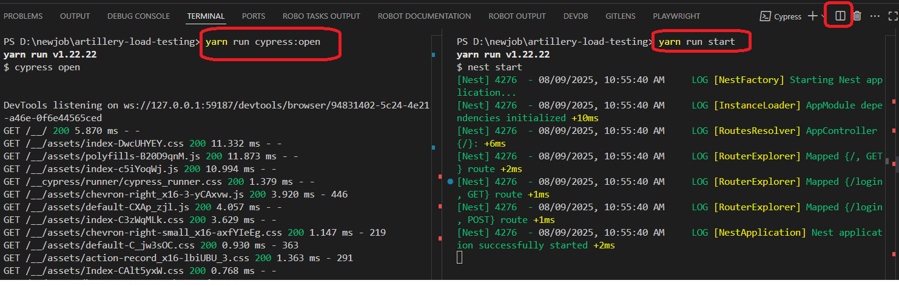

<p align="center">
  <a href="http://nestjs.com/" target="blank"></a>
</p>

[circleci-image]: https://img.shields.io/circleci/build/github/nestjs/nest/master?token=abc123def456
[circleci-url]: https://circleci.com/gh/nestjs/nest

  <p align="center">A progressive <a href="http://nodejs.org" target="_blank">Node.js</a> framework for building efficient and scalable server-side applications.</p>
    <p align="center">
<a href="https://www.npmjs.com/~nestjscore" target="_blank"></a>
<a href="https://www.npmjs.com/~nestjscore" target="_blank"></a>
<a href="https://www.npmjs.com/~nestjscore" target="_blank"></a>
<a href="https://circleci.com/gh/nestjs/nest" target="_blank"></a>
<a href="https://coveralls.io/github/nestjs/nest?branch=master" target="_blank"></a>
<a href="https://discord.gg/G7Qnnhy" target="_blank"></a>
<a href="https://opencollective.com/nest#backer" target="_blank"></a>
<a href="https://opencollective.com/nest#sponsor" target="_blank"></a>
  <a href="https://paypal.me/kamilmysliwiec" target="_blank"></a>
    <a href="https://opencollective.com/nest#sponsor"  target="_blank"></a>
  <a href="https://twitter.com/nestframework" target="_blank"></a>
</p>
  <!--[](https://opencollective.com/nest#backer)
  [](https://opencollective.com/nest#sponsor)-->

## Description

[Nest](https://github.com/nestjs/nest) framework TypeScript starter repository.
From https://www.youtube.com/watch?v=OTm6bfcVuXg&t=1s

## Installation

```bash
$ yarn install
```

## Running the app

```bash
# development
$ yarn run start or $env:PORT=8080; yarn run start

# watch mode
$ yarn run start:dev

# production mode
$ yarn run start:prod
```

## Load Testing

```bash
# Quick artillery test (console output only)
$ yarn run test:artillery:quick

# Artillery test with timestamped JSON report
$ yarn run test:artillery

# Artillery test with timestamped JSON + HTML reports
$ yarn run test:artillery:html

# Open the latest HTML report in browser
$ yarn run report:open

# Load testing workflow (recommended)
$ yarn run start              # Start the app in background
$ Start-Sleep -Seconds 3      # Wait for app to start
$ curl http://localhost:3000  # Verify app is responding
$ yarn run test:artillery:html # Run load test with reports
$ yarn run report:open        # View the HTML report
```

### Report Files
Reports are saved in the `reports/` directory with timestamps:
- **JSON reports**: `load-test-YYYY-MM-DD_HH-mm-ss.json` (machine-readable)
- **HTML reports**: `load-test-YYYY-MM-DD_HH-mm-ss.html` (human-readable)

### Understanding Artillery Reports
- **P95**: 95% of requests completed within this time
- **P99**: 99% of requests completed within this time  
- **Apdex Score**: User satisfaction (0.94-1.00 = Excellent)
- **Request Rate**: Requests per second handled
- **Success Rate**: Percentage of successful requests

### Export report configured in package.json
```
    "test:artillery": "powershell -Command \"$timestamp = Get-Date -Format 'yyyy-MM-dd_HH-mm-ss'; New-Item -ItemType Directory -Force -Path reports; artillery run ./artillery.yaml --output reports/load-test-$timestamp.json\"",
    "test:artillery:html": "powershell -Command \"$timestamp = Get-Date -Format 'yyyy-MM-dd_HH-mm-ss'; New-Item -ItemType Directory -Force -Path reports; artillery run ./artillery.yaml --output reports/load-test-$timestamp.json; artillery report reports/load-test-$timestamp.json --output reports/load-test-$timestamp.html\"",
    "test:artillery:quick": "artillery run ./artillery.yaml"
```

### Summarize the latest Artillery JSON report (human-readable)
```
$ yarn run test:artillery_summary
```
This will print a summary to the console, showing if your test PASSED or FAILED thresholds, and why.

### Test

```
$ yarn run test
$ yarn run test:e2e
$ yarn run test:cov
```

### Cypress E2E & Login Performance Testing

### Cypress Login Test
Open 2 terminals

```bash
# Run website first
yarn run start
# Run Cypress login test (headless)
yarn run test:cypress:login
# Open Cypress interactive test runner
yarn run cypress:open
```

- Edit the test in `cypress/e2e/login.cy.js` to match your login page selectors and assertions.

### Artillery Login Performance Test
```bash
# Quick login test (console output only)
yarn run test:artillery:login

# Login test with timestamped JSON report
yarn run test:artillery:login:json

# Login test with timestamped JSON + HTML reports
yarn run test:artillery:login:html

# Config-driven login test (uses shared YAML configuration)
yarn run test:artillery:login:config

# Generate test data from configuration
yarn run generate:test-data

# Summarize the latest login test JSON report
yarn run test:artillery:login:summary
```

### Login Test Report Files
Login test reports are saved in the `reports/` directory with timestamps:
- **JSON reports**: `login-test-YYYY-MM-DD_HH-mm-ss.json` (machine-readable)
- **HTML reports**: `login-test-YYYY-MM-DD_HH-mm-ss.html` (human-readable)

### Configuration-Driven Development
The login feature uses a shared configuration file `config/login-config.yaml` that defines:
- **UI Selectors**: CSS selectors for all login page elements
- **Test Data**: Valid/invalid user credentials for testing
- **API Contracts**: Expected request/response formats
- **Performance Thresholds**: Acceptable response times and success rates

This allows frontend and backend developers to work in parallel using the same "contract."

- Edit `artillery-login.yaml` to match your real login API and payload if needed.
